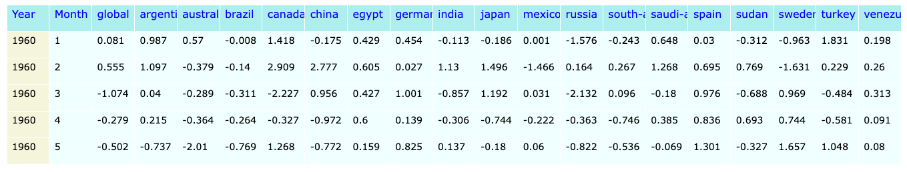

## CQ-ESN

CQ-ESN: Hybrid Classical-Quantum Echo State Networks for Time Series Forecasting.  

CQ-ESN was designed to facilitate separating the contribution of different effects (real *vs* complex-valued states, interference, entangling) in Quantum Echo State Networks. Standard ESNs use ridge regression (implemented *via* a closed form version of the normal equations) to learn a linear readout from the reservoir states to the target output. In CQ-ESN, we replace this **classical ridge regression** with **kernel ridge regression** or with **quantum kernel ridge regression**, which uses a quantum kernel to compute the inner products between reservoir states in a $n$-dimensional feature space. The quantum kernel is estimated using a quantum circuit that encodes the reservoir states as quantum states and measures their **overlaps**. An alternative to this approach would be to use a quantum version of the normal equation to implement the ridge regression, but this would require a quantum algorithm for matrix inversion (e.g., [HHL](https://arxiv.org/abs/2507.15537)), which is less efficient than using quantum kernels for regression. Future versions of CQ-ESN will explore this alternative approach. Other alternatives (i.e. [here](https://arxiv.org/abs/2412.07910), using quantum circuits to directly learn the readout weights) have also been described.

<div style="border:1px solid #ccc; border-radius:6px; padding:12px; background: #050094; max-width:90%; margin-bottom:20px; margin-left:20px; margin-right:20px;">

#### CQ-ESN Installation

We recommend using CQ-ESN in a virtual environment. The following are the recommended steps to generate a suitable environment using pip and conda:

```bash
conda create -n ibm_qml_311 python=3.11.13
conda activate ibm_qml_311
conda update pip
pip3 install qiskit-machine-learning
pip3 install 'qiskit-machine-learning[torch]'
pip3 install 'qiskit-machine-learning[sparse]'
conda install --channel=numba llvmlite
pip3 install nlopt
pip3 install pandas
pip3 install openpyxl
pip3 install matplotlib
pip3 install seaborn
pip3 install plotly
pip3 install ipykernel
pip3 install ipympl
pip3 install jupyter
pip3 install jupyterlab
pip3 install pyprind
pip3 install statsmodels
pip3 install xgboost
pip3 install ipywidgets
pip3 install 'qiskit[visualization]'
pip3 install pyTensorlab
pip3 install qiskit-aer
pip3 install qiskit-ibm-runtime
pip3 install torch_geometric
conda install -c conda-forge umap-learn
conda deactivate    
```

CQ-ESN adopts the `qiskit_machine_learning` library, which provides a convenient interface for computing quantum kernels using various quantum circuits and feature maps. 

Additional details about CQ-ESN implementation can be found in the jupyter notebook **CQ_ESN_readme.ipynb** located in this folder.

</div>


<div style="border:1px solid #ccc; border-radius:6px; padding:12px; background: #050094; max-width:90%; margin-bottom:20px; margin-left:20px; margin-right:20px;">


#### CQ-ESN Forecasting strategy

Several examples of how to run CQ-ESN for forecasting are provided in the jupyter notebooks inside the folder **tests**. The task at hand is to forecast global average surface temperatures (TAVG) using historical climate data provided by the [Berkeley Earth](https://berkeleyearth.org/data/) project.

<center></center>

The TAVG dataset used in the examples is a subset of the **global** average surface temperature dataset provided by the Berkeley Earth project. It contains monthly average temperatures from 1960 to 2020, measured in degrees Celsius. The original **global** dataset is expanded to include **local** climate data from 18 countries in different continents.

<center></center>

The dataset is multivaried (global + local, 19 variables), but we focus on forecasting and plotting primarily the global average surface temperature (TAVG). Thus, while CQ-ESN forecasts all 19 variables in the **horizon** in order to roll forward by 1 timestep the **lag** of time used for prediction, only the global average surface temperature (TAVG) is plotted.

Note that this dataset is not ideal for forecasting, as it is relatively small (720 monthly data points) and has a strong trend. Popular ESN programs for climate predictions (e.g., [here](https://xesn.readthedocs.io/en/latest/)) typically perform very well in the training range, but fail to extrapolate the strong trend in the test range, yielding a periodic but "flat" forecast. CQ-ESN is not designed to solve this problem, but rather to explore the contribution of quantum effects in ESNs. Despite this design bias CQ-ESN performs reasonably well also in the test range.

#### OUTCOME

A very large number of different CQ-ESN settings (only a few of which are reported in the **tests** folder) were tested. Altogether, the best results were obtained using:

- Complex-valued reservoirs and states
- Kernel Ridge Regression readout
- States dimensionality reduction by SVD
- Normalization of the states prior to calculating the $W_{out}$ weight matrix
- Denormalization of the predictions

##### Important considerations:

1. **Complex-valued** reservoirs and states produce only a minor improvement of the evaluation metrics (NRMSE,MAE,IQR area) *versus* the corresponding **real-valued** reservoirs and states. 
2. **Quantum kernels** do not appear to produce an improvement of the metrics versus the equivalent **Classical Kernels** with the additional drawback of several orders of magnitude slow-down.
3. **States Normalization** and **Predictions Denormalization** appear to be the most significant factor in achieve a decrease of the Interquartile Area of the distribution of both ***non-autoregressive*** and ***autoregressive*** predictions, when multiple CQ-ESN runs are carried out with random initialization of the reservoir parameters.


