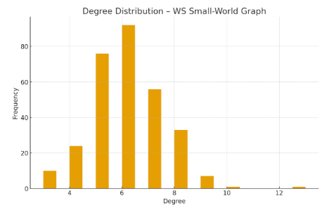

## CQ-ESN

CQ-ESN: Hybrid Classical-Quantum Echo State Networks for Time Series Forecasting.  

CQ-ESN was designed to facilitate separating the contribution of different effects (real *vs* complex-valued states, interference, entangling) in Quantum Echo State Networks. Standard ESNs use ridge regression (implemented *via* a closed form version of the normal equations) to learn a linear readout from the reservoir states to the target output. In CQ-ESN, we replace this **classical ridge regression** with **kernel ridge regression** or with **quantum kernel ridge regression**, which uses a quantum kernel to compute the inner products between reservoir states in a $n$-dimensional feature space. The quantum kernel is estimated using a quantum circuit that encodes the reservoir states as quantum states and measures their **overlaps**. An alternative to this approach would be to use a quantum version of the normal equation to implement the ridge regression, but this would require a quantum algorithm for matrix inversion (e.g., [HHL](https://arxiv.org/abs/2507.15537)), which is less efficient than using quantum kernels for regression. Future versions of CQ-ESN will explore this alternative approach. Other alternatives (i.e. [here](https://arxiv.org/abs/2412.07910), using quantum circuits to directly learn the readout weights) have also been described.

While the current CQ-ESN implementation represents a direct conversion of the classical ESN algorithm to a quantum method, one complication is associated with the fact that by definition quantum state vectors are normalized. Unfortunately, ESN states normalization is associated with some loss of information. This can be easily verified by running a standard closed-form ridge regression on normalized states. To overcome this problem, we multiply the predictions derived from the readout by the same norm used to normalize the states. This is a common practice in quantum machine learning when using quantum kernels derived from state overlaps, which allows us to observe the additional quantum effects from entanglement, while mitigating the information loss due to normalization. 

<div style="border:1px solid #ccc; border-radius:6px; padding:12px; background: #050094; max-width:90%; margin-bottom:20px; margin-left:20px; margin-right:20px;">

#### CQ-ESN Installation

We recommend using CQ-ESN in a virtual environment. The following are the recommended steps to generate a suitable environment using pip and conda:

```bash
conda create -n ibm_qml_311 python=3.11.13
conda activate ibm_qml_311
conda update pip
pip3 install qiskit-machine-learning
pip3 install 'qiskit-machine-learning[torch]'
pip3 install 'qiskit-machine-learning[sparse]'
conda install --channel=numba llvmlite
pip3 install nlopt
pip3 install pandas
pip3 install openpyxl
pip3 install matplotlib
pip3 install seaborn
pip3 install plotly
pip3 install ipykernel
pip3 install ipympl
pip3 install jupyter
pip3 install jupyterlab
pip3 install pyprind
pip3 install statsmodels
pip3 install xgboost
pip3 install ipywidgets
pip3 install 'qiskit[visualization]'
pip3 install pyTensorlab
pip3 install qiskit-aer
pip3 install qiskit-ibm-runtime
pip3 install torch_geometric
conda install -c conda-forge umap-learn
conda deactivate    
```

CQ-ESN adopts the `qiskit_machine_learning` library, which provides a convenient interface for computing quantum kernels using various quantum circuits and feature maps. Unfortunately, the `qiskit_machine_learning` library requires numpy 2.4, while the version of Pytorch loaded with `qiskit-machine-learning[torch]` is compatible with numpy 1.26. This results in runtime errors only in the rare occasions in which a numpy C extension is called to act on torch tensors. CQ-ESN has a workaround for this issue based on a simple patch.

</div>

<div style="border:1px solid #ccc; border-radius:6px; padding:12px; background: #050094; max-width:90%; margin-bottom:20px; margin-left:20px; margin-right:20px;">

### CQ-ESN Reservoirs

An Echo State Network (ESN) reservoir $W_{\text{res}}$ is literally a ***sparse random graph***, encoded in matrix form.

•	Only a small percentage of the entries in $W_{\text{res}}$ are non-zero.

•	Those non-zero entries define the edges of the reservoir graph.

•	ESN reservoirs are often generated by selecting a random sparse adjacency structure (e.g., 5% connectivity).


Different types of Reservoir Adjacency matrixes (e.g., `sparse random, ER`, `small-world, WS`, `scale-free, BA`, `custom, CU`) can impact the performance of an ESN. The reservoir can be easily generated using random graph models. These models define which connections exist before filling them with random weights.


#### ER (Erdős–Rényi) reservoir

**Characteristics**:

- Connections placed uniformly at random.
- Degree distribution is narrow (most neurons have similar degree).
- No hubs, little clustering, short average path lengths.
- Dynamics tend to be homogeneous across neurons.

<center></center>

**Best for**: 

- General-purpose tasks where structure does not matter much, such as:
- Basic time-series prediction (e.g., autoregressive signals)
- Chaotic system prediction (e.g., Lorenz)
- Classification tasks with simple temporal dependencies

The lack of structure makes ER reservoirs flexible and stable. Often the most predictable in terms of spectral radius scaling. However, since they lack specialized connectivity patterns, they may require larger sizes to capture complex dynamics.


#### BA (Barabasi-Albert) reservoir

BA automatically generates hubs (high-degree neurons), which create long-range integration.

**Characteristics**:

- A few high-degree hubs dominate the connectivity.
- Scale-free degree distribution (power law).
- Hubs can act as “information integrators.”

**Best for**:

- Tasks where long-range integration or global coordination is beneficial.
- Long-term temporal dependencies
- Multiscale or hierarchical structure in data
- Sensor fusion or multimodal input
- Memory-intensive tasks (but not too chaotic)

Hubs rapidly accumulate and spread activation, enabling efficient information flow across the reservoir. However, too much hub-driven feedback may destabilize the echo state property. For this reason, BA reservoirs often require careful tuning of the spectral radius, sparsity, input scaling and regularization (ridge regression) to maintain stability.

A scale-free reservoir (such as one generated by the Barabási–Albert model) is a reservoir whose degree distribution follows a power law:

$P(k) \propto k^{-\gamma},\quad \gamma \approx 2\text{–}3$

<center></center>

A scale-free network does not have a characteristic scale for how connected the nodes are. In contrast, in a random graph (like Erdős–Rényi), most nodes have roughly the same number of connections (same degree), concentrated around a mean.

In a scale-free graph (BA) degrees vary widely — massive variability. The network has no characteristic degree scale, because:

*	There is no meaningful “typical” number of connections.
*	The distribution looks the same no matter how much you zoom in on the tail.

The degree distribution for a Barabási–Albert reservoir is a power law (key property), the probability that a neuron has degree (k) is:

$P(k) \sim k^{-3}$

This means:

•	Many nodes with small degree (e.g., 2–4)
•	A small number of nodes with high degree

This degree distribution persists no matter how large the reservoir grows — it scales with system size. That’s the “free of scale” part.

In a scale-free reservoir:

*	A few reservoir neurons are hubs
→ they receive input from many others
→ they strongly influence global dynamics

*	Most neurons are peripheral
→ localized influence

This leads to:
✔ Long-range information propagation: Hubs mix information from many parts of the reservoir.
✔ Multi-timescale dynamics Hubs produce slow, stable signals (accumulating information),
while peripheral nodes produce fast, local responses.
✔ Good for tasks with complex, long-term dependencies


#### WS (Watts-Strogatz) small world reservoir

- k controls local connectivity; typical values 4–10.
- beta controls randomness:
- 0.0 → ring lattice (highly structured)
- 0.1 → small-world
- 1.0 → becomes random like ER

**Characteristics**:

- High clustering (like a regular lattice).
- Shortcuts create low average path lengths.
- Balance between local processing and global mixing.

<center></center>

**Best for**:

- Tasks that need a mix of short-term and long-term memory.
- Speech recognition
- Nonlinear autoregressive tasks
- Spatio-temporal pattern processing
- Robot control / motor signals
- Reservoir computing on physical systems


Local clusters maintain stable short-term memory. Shortcuts give access to long-range interactions. Often provides a naturally tunable balance via the rewiring probability. However, too much clustering can reduce memory capacity, while too many shortcuts can lead to instability. Performance is sensitive to:

- rewiring probability
- sparsity
- spectral radius

With too many shortcuts becomes like ER.


#### CQ-ESN reservoir implementation details
 
We use `Pytorch Geometric` and `NetworkX` to generate the graph structure and NumPy to create the reservoir weight matrix. Four steps are involved in this process:

1. generate the graph

2. convert the adjacency into an n×n reservoir matrix

3. assign random non-zero weights

4. scale the spectral radius to a desired value

We test the effect of using ***real-valued*** vs. **complex-valued** weights in the ESN reservoir. Complex valued states generated when using a complex-valued reservoir allow ***interference*** to become a factor in the ridge regression readout. Besides allowing *interference* effects to occur, complex valued states can also be directly mapped to quantum states vectors using `amplitude encoding`, with or without additional gates in the feature mapping, specifically designed to achieve additional degrees or types of entanglement. Different types of quantum feature mapping (e.g., `efficient-su2`,`ZFeatureMap`, `ZZFeatureMap`, `PauliFeatureMap`, etc.) are possible with `qiskit`, although, when starting from complex-valued states, *amplitude encoding* is the most efficient, as it requires $\log_2(n)$ qubits, where $n$ is the dimension of the feature space. 

