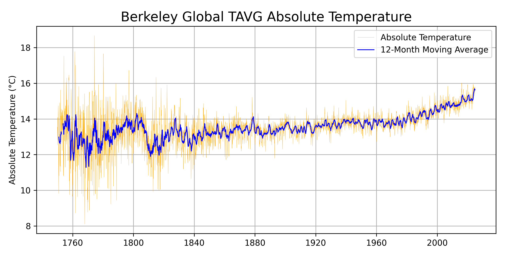
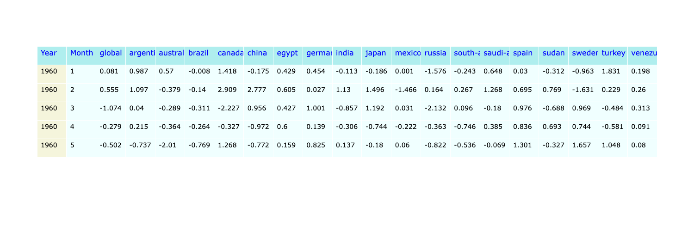
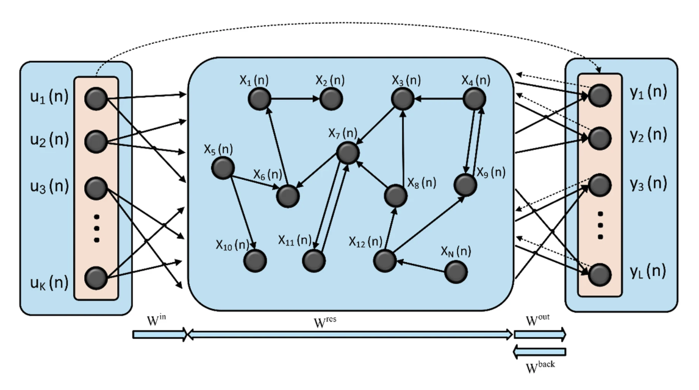
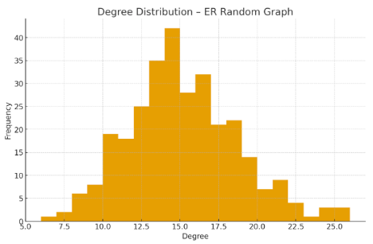
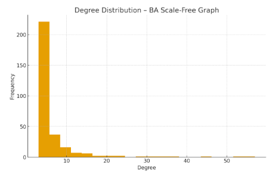

## CQ-ESN

CQ-ESN: Hybrid Classical-Quantum Echo State Networks for Time Series Forecasting.  

CQ-ESN was designed to facilitate separating the contribution of different effects (real *vs* complex-valued states, interference, entangling) in Quantum Echo State Networks. Standard ESNs use ridge regression (implemented *via* a closed form version of the normal equations) to learn a linear readout from the reservoir states to the target output. In CQ-ESN, we replace this **classical ridge regression** with **kernel ridge regression** or with **quantum kernel ridge regression**, which uses a quantum kernel to compute the inner products between reservoir states in a $n$-dimensional feature space. The quantum kernel is estimated using a quantum circuit that encodes the reservoir states as quantum states and measures their **overlaps**. An alternative to this approach would be to use a quantum version of the normal equation to implement the ridge regression, but this would require a quantum algorithm for matrix inversion (e.g., [HHL](https://arxiv.org/abs/2507.15537)), which is less efficient than using quantum kernels for regression. Future versions of CQ-ESN will explore this alternative approach. Other alternatives (i.e. [here](https://arxiv.org/abs/2412.07910), using quantum circuits to directly learn the readout weights) have also been described.

While the current CQ-ESN implementation represents a direct conversion of the classical ESN algorithm to a quantum method, one complication is associated with the fact that by definition quantum state vectors are normalized. Unfortunately, ESN states normalization is associated with some loss of information. This can be easily verified by running a standard closed-form ridge regression on normalized states. To overcome this problem, we multiply the predictions derived from the readout by the same norm used to normalize the states. This is a common practice in quantum machine learning when using quantum kernels derived from state overlaps, which allows us to observe the additional quantum effects from entanglement, while mitigating the information loss due to normalization. 

<div style="border:1px solid #ccc; border-radius:6px; padding:12px; background: #050094; max-width:90%; margin-bottom:20px; margin-left:20px; margin-right:20px;">

#### CQ-ESN Installation

We recommend using CQ-ESN in a virtual environment. The following are the recommended steps to generate a suitable environment using pip and conda:

```bash
conda create -n ibm_qml_311 python=3.11.13
conda activate ibm_qml_311
conda update pip
pip3 install qiskit-machine-learning
pip3 install 'qiskit-machine-learning[torch]'
pip3 install 'qiskit-machine-learning[sparse]'
conda install --channel=numba llvmlite
pip3 install nlopt
pip3 install pandas
pip3 install openpyxl
pip3 install matplotlib
pip3 install seaborn
pip3 install plotly
pip3 install ipykernel
pip3 install ipympl
pip3 install jupyter
pip3 install jupyterlab
pip3 install pyprind
pip3 install statsmodels
pip3 install xgboost
pip3 install ipywidgets
pip3 install 'qiskit[visualization]'
pip3 install pyTensorlab
pip3 install qiskit-aer
pip3 install qiskit-ibm-runtime
pip3 install torch_geometric
conda install -c conda-forge umap-learn
conda deactivate    
```

CQ-ESN adopts the `qiskit_machine_learning` library, which provides a convenient interface for computing quantum kernels using various quantum circuits and feature maps. Unfortunately, the `qiskit_machine_learning` library requires numpy 2.4, while the version of Pytorch loaded with `qiskit-machine-learning[torch]` is compatible with numpy 1.26. This results in runtime errors only in the rare occasions in which a numpy C extension is called to act on torch tensors. CQ-ESN has a workaround for this issue based on a simple patch.

</div>

<div style="border:1px solid #ccc; border-radius:6px; padding:12px; background: #050094; max-width:90%; margin-bottom:20px; margin-left:20px; margin-right:20px;">

<div style="border:1px solid #ccc; border-radius:6px; padding:12px; background: #050094; max-width:90%; margin-bottom:20px; margin-left:20px; margin-right:20px;">

#### CQ-ESN Forecasting strategy

Several examples of how to run CQ-ESN for forecasting are provided in the jupyter notebooks inside the folder **CQ_ESN_TESTS**. The task at hand is to forecast global average surface temperatures (TAVG) using historical climate data provided by the [Berkeley Earth](https://berkeleyearth.org/data/) project.

<center></center>

The TAVG dataset used in the examples is a subset of the **global** average surface temperature dataset provided by the Berkeley Earth project. It contains monthly average temperatures from 1960 to 2020, measured in degrees Celsius. The original **global** dataset is expanded to include **local** climate data from 18 countries in different continents.

<center></center>

The dataset is multivaried (global + local, 19 variables), but we focus on forecasting and plotting primarily the global average surface temperature (TAVG). Thus, while CQ-ESN forecasts all 19 variables in the **horizon** in order to roll forward by 1 timestep the **lag** of time used for prediction, only the global average surface temperature (TAVG) is plotted.

Note that this dataset is not ideal for forecasting, as it is relatively small (720 monthly data points) and has a strong trend. Popular ESN programs for climate predictions (e.g., [here](https://xesn.readthedocs.io/en/latest/)) typically perform very well in the training range, but fail to extrapolate the strong trend in the test range, yielding a periodic but "flat" forecast. CQ-ESN is not designed to solve this problem, but rather to explore the contribution of quantum effects in ESNs. Despite this design bias CQ-ESN performs reasonably well also in the test range.

##### - We train the CQ-ESN models using **walk-forward validation** with a ***rolling window*** approach over the <u>**training dataset**</u>. 

A general CQ-ESN object is generated by specifying the ESN parameters (e.g., reservoir type, size and values, spectral radius, input scaling, leak rate, etc.) and the training parameters (e.g., readout method and parameters, dimensionality reduction method and parameters, etc.). Training is carried out by calling the `train_from_dataloader` method, which takes as input a Pytorch dataloader serving batches of lagged data. `train_from_dataloader` can be called with different parameters from those initially specified in the object generation, allowing the exploration of different training strategies (e.g., different readout methods and parameters, dimensionality reduction methods, etc.) without having to generate a new object each time.

##### - For training we use a ***lag*** of 12 months (1 year) and a ***horizon*** of 1 month ahead forecasting. The training window ***rolls forward*** by 1 month at each step.

Lagged data is prepared as a single Pytorch **dataset** and **dataloader**, which serves batches of $n$ sequences during training. For example, a batch of 20 sequences contains 20 different input sequences of length equal to the lag (e.g., 12 months) and their corresponding target values (e.g., the temperature anomaly 1 month ahead of the last month in the input sequence). In general, sequences are multivariate. For example, if each timestep is a $f$-dimensional feature vector, a batch of $b$ sequences (lags) of $t$ timesteps will be a tensor of dimensions $b \times t \times f$ and the corresponding horizon target will be a matrix of dimensions $b \times f$. 

States update is carried out according to the ESN formula:

$\mathbf{x}(t) = (1 - \alpha) \mathbf{x}(t-1) + \alpha \tanh(\mathbf{W}_{\text{in}} \mathbf{u}(t) + \mathbf{W}_{\text{res}} \mathbf{x}(t-1) + \mathbf{b})$

<center></center>

where $\mathbf{u}(t)$ is the input at time $t$, $\mathbf{x}(t)$ is the state of the reservoir at time $t$, $\mathbf{W}_{\text{in}}$ is the input weight matrix, $\mathbf{W}_{\text{res}}$ is the reservoir weight matrix, $\mathbf{b}$ is a bias term, and $\alpha$ is the leak rate. This formula is typically applied sequentially for each time step in the input sequence, which can be computationally expensive for long sequences and large reservoirs. To speed up the training process, we can use an `einsum` tensor operation to update the states of the ESN in a single tensor product for all time steps in the input sequence, without having to loop through each time step individually. The `einsum` operation is a powerful tool for performing complex tensor operations in a concise and efficient way, and it can significantly reduce the computational cost of training ESN models at the cost of a small reduction in accuracy. The CQ-ESN default is to use `einsum` for faster training (but it can be set to use the traditional loop approach). CQ-ESN does not use a $\mathbf{W}_{\text{back}}$ matrix (as shown in the figure above) to update the states during training, based on the predictions from the previous step or the actual target values (i.e., *teacher forcing*).

As shown in the update formula, states are partially 'leaked' from one time step to the next (or one batch to the next if using `einsum`), so it does make a difference if the input sequences in a batch are ***contiguous*** or ***shuffled***. If the input sequences in a batch are contiguous, the states of the ESN will be updated sequentially, allowing the model to learn from the temporal dependencies in the data. If the input sequences in a batch are not *contiguous* (that is, they are *shuffled*), states may be leaked from the future to the past. In general, whether the best result is obtained by using contiguous or shuffled sequences in a batch depends on the specific characteristics of the data and the model.

##### - Models performance is very dependent on the random initialization of the ESN parameters (e.g., reservoir type, size and values, spectral radius, input scaling, leak rate, etc.). 

Therefore, we repeat the training process for multiple random initializations of the ESN parameters to obtain a distribution of forecasts for uncertainty quantification. We find that a minimum of 20 random initializations is necessary to obtain a reliable distribution.

##### - Models are optimized by minimizing the mean squared error between the predicted and actual target values in the horizon that follows each lag.

Optimized $W_{out}$ readout weights are found by: 
1. `Ridge regression` for the linear readout. 
2. `Kernel ridge regression` with a choice of kernels (i.e., linear, RBF, etc.).
3. `Quantum kernel ridge regression` with a choice of quantum kernels circuit parameters (e.g., feature mapping, number of qubits, depth, degree of entanglement, etc.).
4. `Quantum ridge regression` with the [HHL (Harrow-Hassidim-Lloyd)](https://github.com/QCOL-LU/QLSAs) algorithm. This is a quantum algorithm for solving linear systems of equations, which can be used to implement the normal equations for ridge regression. <u>Currently not implemented.</u> Future versions of CQ-ESN will explore this alternative approach.

It is also possible to preprocess the ESN states with a single or a combination of dimensionality reduction techniques (`SVD, UMAP, quantum kernel PCA`) before carrying out the ridge regression. If quantum kernel PCA is used taking advantage of the `qpca_kernel` method of IBM Qiskit's Machine learning library, the default is to use just simple ridge regression to calculate the ESN output weights ($\mathbf{W}_{\text{out}}$ matrix). QPCA was shown to be effective at better separating data for classification even without actual dimension reduction (see [here](https://qiskit-community.github.io/qiskit-machine-learning/tutorials/03_quantum_kernel.html)). However, a comparable beneficial effect was not observed in CQ-ESN for regression tasks. Preprocessing the states to reduce their dimensionality helps significantly removing noise and its critical for quantum applications that are going to be run natively in qiskit (like we do in our examples), with the Air simulator, or in the actual quantum backend hardware, in order to reduce the number of qubits required. In particular, only feature vectors mapped to no more than 32 qubits can be run classically without recompiling numpy locally. In our examples, we typically reduce the states dimensions to 8 or 16 (3 or 4 qubits with **amplitude** or **efficient_su2** encoding in the quantum kernel).

Dimensionality reduction with UMAP represents a special challenge because UMAP was not originally designed to be applicable to complex-valued data. Various strategies have been proposed to apply UMAP to complex-valued data, such as using the real and imaginary parts or the magnitude and phase of the complex numbers as separate features. Instead, CQ-ESN calculates a complex distance matrix for *fit-transforming* the training data and then calculates by SVD a *transformation matrix* usable for prediction with either training or validation data. However, standard UMAP *fit-transform* and *transform* methods are used if the states are real-valued. More details on the UMAP implementation for complex-valued data are provided below. In general, we found the optimal use of UMAP requires first reducing the states dimensions linearly with SVD at some intermediate level (i.e., 16 dimensions) to remove noise, and then to reduce the dimensions further (i.e., 8 dimensions) with UMAP to capture the non-linear structure of the data.

##### - Once training is complete, the model $W_{out}$ prediction matrix is defined and unchangeable, only the ***states*** can still be modified: depending on how the states are handled we can have ***non-autoregressive*** and ***autoregressive*** predictions.

Prediction is carried out with the method `predict`, which can be called with different parameters from those initially specified in the object generation and training, allowing us to explore different prediction strategies (e.g., different readout methods and parameters, dimensionality reduction methods and parameters, etc.) without having to generate a new object for each prediction strategy.

After training we typically carry out two types of predictions on the **training and validation datasets** to evaluate the performance of the models:

1. starting from the ***first lag*** we predict the horizon values for both the training and validation datasets using the trained models in a ***non-autoregressive*** fashion. This allows us to evaluate the performance of the models on both datasets without compounding errors from previous predictions. If each sequence timestep if $f$-dimensional, the model will output an $f$-dimensional prediction for each rollout timestep. It should be noted this can be done **with** or **without** <u>updating</u> the training states of the ESN during roll-over prediction. If we are **not updating** the states during prediction roll-over, at every stepsize the model will use the states finalized during training in the update formula:

$\mathbf{x}(t) = (1 - \alpha) \mathbf{x}_{\text{train}} + \alpha \tanh(\mathbf{W}_{\text{in}} \mathbf{u}(t) + \mathbf{W}_{\text{res}} \mathbf{x}(t-1) + \mathbf{b})$

$\hat{\mathbf{y}}(t) = \mathbf{W}_{\text{out}} \mathbf{x}(t)$

<div style="margin-left: 40px;">

This means that predictions will be most accurate only in the part of the training or validation data that is most similar to the part of the training data in which the states were finalized. Instead, if we are **updating** during prediction roll-over, at every stepsize the model will use the states from the previous time step to update the training state:
</div>

$\mathbf{x}(t) = (1 - \alpha) \mathbf{x}_{\text{train}} + \alpha \tanh(\mathbf{W}_{\text{in}} \mathbf{u}(t) + \mathbf{W}_{\text{res}} \mathbf{x}(t-1) + \mathbf{b})$

$\hat{\mathbf{y}}(t) = \mathbf{W}_{\text{out}} \mathbf{x}(t)$

$\mathbf{x}_{\text{train}} = \mathbf{x}(t)$

<div style="margin-left: 40px;">
This means that the states will adapt to the new input data, allowing the model to make more accurate predictions. Ideally, since the ESN states keep a *memory* of the training input data, we expect predictions to be reasonably accurate as the models starts from the beginning of the training set and rolls through the rest of the training set, and to become progressively less accurate after the model transitions in the validation set, since the model has not seen the validation data during training.
</div>

2. starting from the ***last lag*** in the training set we use the trained models to make ***autoregressive predictions*** in the validation set of global temperature anomalies. This means we use the predicted values from the previous time step as input for the next time step. Each time a predicted horizon is added, the first timestep of the sequence is removed to keep the sequence length constant. This allows us to evaluate the performance of the models in a more realistic forecasting scenario, where we do not have access to the actual future values and must rely on our predictions: in this case, since we make predictions based on predictions, the errors compound over time, leading to a decrease in accuracy as we forecast further into the future. Similar to the non-autoregressive case, we can choose to update or not update the states during prediction roll-over. If we are **not updating** the states during prediction roll-over, at every stepsize the model will use the states finalized during training.


### CQ-ESN Reservoirs

An Echo State Network (ESN) reservoir $W_{\text{res}}$ is literally a ***sparse random graph***, encoded in matrix form.

•	Only a small percentage of the entries in $W_{\text{res}}$ are non-zero.

•	Those non-zero entries define the edges of the reservoir graph.

•	ESN reservoirs are often generated by selecting a random sparse adjacency structure (e.g., 5% connectivity).


Different types of Reservoir Adjacency matrixes (e.g., `sparse random, ER`, `small-world, WS`, `scale-free, BA`, `custom, CU`) can impact the performance of an ESN. The reservoir can be easily generated using random graph models. These models define which connections exist before filling them with random weights.


#### ER (Erdős–Rényi) reservoir

**Characteristics**:

- Connections placed uniformly at random.
- Degree distribution is narrow (most neurons have similar degree).
- No hubs, little clustering, short average path lengths.
- Dynamics tend to be homogeneous across neurons.

<center></center>

**Best for**: 

- General-purpose tasks where structure does not matter much, such as:
- Basic time-series prediction (e.g., autoregressive signals)
- Chaotic system prediction (e.g., Lorenz)
- Classification tasks with simple temporal dependencies

The lack of structure makes ER reservoirs flexible and stable. Often the most predictable in terms of spectral radius scaling. However, since they lack specialized connectivity patterns, they may require larger sizes to capture complex dynamics.


#### BA (Barabasi-Albert) reservoir

BA automatically generates hubs (high-degree neurons), which create long-range integration.

**Characteristics**:

- A few high-degree hubs dominate the connectivity.
- Scale-free degree distribution (power law).
- Hubs can act as “information integrators.”

**Best for**:

- Tasks where long-range integration or global coordination is beneficial.
- Long-term temporal dependencies
- Multiscale or hierarchical structure in data
- Sensor fusion or multimodal input
- Memory-intensive tasks (but not too chaotic)

Hubs rapidly accumulate and spread activation, enabling efficient information flow across the reservoir. However, too much hub-driven feedback may destabilize the echo state property. For this reason, BA reservoirs often require careful tuning of the spectral radius, sparsity, input scaling and regularization (ridge regression) to maintain stability.

A scale-free reservoir (such as one generated by the Barabási–Albert model) is a reservoir whose degree distribution follows a power law:

$P(k) \propto k^{-\gamma},\quad \gamma \approx 2\text{–}3$

<center></center>

A scale-free network does not have a characteristic scale for how connected the nodes are. In contrast, in a random graph (like Erdős–Rényi), most nodes have roughly the same number of connections (same degree), concentrated around a mean.

In a scale-free graph (BA) degrees vary widely — massive variability. The network has no characteristic degree scale, because:

*	There is no meaningful “typical” number of connections.
*	The distribution looks the same no matter how much you zoom in on the tail.

The degree distribution for a Barabási–Albert reservoir is a power law (key property), the probability that a neuron has degree (k) is:

$P(k) \sim k^{-3}$

This means:

•	Many nodes with small degree (e.g., 2–4)
•	A small number of nodes with high degree

This degree distribution persists no matter how large the reservoir grows — it scales with system size. That’s the “free of scale” part.

In a scale-free reservoir:

*	A few reservoir neurons are hubs
→ they receive input from many others
→ they strongly influence global dynamics

*	Most neurons are peripheral
→ localized influence

This leads to:
✔ Long-range information propagation: Hubs mix information from many parts of the reservoir.
✔ Multi-timescale dynamics Hubs produce slow, stable signals (accumulating information),
while peripheral nodes produce fast, local responses.
✔ Good for tasks with complex, long-term dependencies


#### WS (Watts-Strogatz) small world reservoir

- k controls local connectivity; typical values 4–10.
- beta controls randomness:
- 0.0 → ring lattice (highly structured)
- 0.1 → small-world
- 1.0 → becomes random like ER

**Characteristics**:

- High clustering (like a regular lattice).
- Shortcuts create low average path lengths.
- Balance between local processing and global mixing.

<center></center>

**Best for**:

- Tasks that need a mix of short-term and long-term memory.
- Speech recognition
- Nonlinear autoregressive tasks
- Spatio-temporal pattern processing
- Robot control / motor signals
- Reservoir computing on physical systems


Local clusters maintain stable short-term memory. Shortcuts give access to long-range interactions. Often provides a naturally tunable balance via the rewiring probability. However, too much clustering can reduce memory capacity, while too many shortcuts can lead to instability. Performance is sensitive to:

- rewiring probability
- sparsity
- spectral radius

With too many shortcuts becomes like ER.


#### CQ-ESN reservoir implementation details
 
We use `Pytorch Geometric` and `NetworkX` to generate the graph structure and NumPy to create the reservoir weight matrix. Four steps are involved in this process:

1. generate the graph

2. convert the adjacency into an n×n reservoir matrix

3. assign random non-zero weights

4. scale the spectral radius to a desired value

We test the effect of using ***real-valued*** vs. **complex-valued** weights in the ESN reservoir. Complex valued states generated when using a complex-valued reservoir allow ***interference*** to become a factor in the ridge regression readout. Besides allowing *interference* effects to occur, complex valued states can also be directly mapped to quantum states vectors using `amplitude encoding`, with or without additional gates in the feature mapping, specifically designed to achieve additional degrees or types of entanglement. Different types of quantum feature mapping (e.g., `efficient-su2`,`ZFeatureMap`, `ZZFeatureMap`, `PauliFeatureMap`, etc.) are possible with `qiskit`, although, when starting from complex-valued states, *amplitude encoding* is the most efficient, as it requires $\log_2(n)$ qubits, where $n$ is the dimension of the feature space. 

<div style="border:1px solid #ccc; border-radius:6px; padding:12px; background: #050094; max-width:90%; margin-bottom:20px; margin-left:20px; margin-right:20px;">

### Specialized Validation Metrics 

We use two specialized validation metrics to evaluate the performance of the models: `NRMSE` and `PSD-NRMSE`.

**`NRMSE`**, or `Normalized Root Mean Square Error`, is a statistical metric that measures the difference between predicted and observed values. It is calculated by dividing the Root Mean Square Error (RMSE) by a normalization factor, most commonly the range of the observed values (max - min) or the mean of the observed values. The result can be expressed as a percentage and is used to compare model performance across different scales by making the error relative to the data's magnitude. A lower NRMSE value indicates a better fit. 

There are several common ways to calculate NRMSE, depending on the normalization method: 

• By range: Divide the RMSE by the difference between the maximum and minimum observed values. 

• By mean: Divide the RMSE by the mean of the observed values. 

• By standard deviation: Divide the RMSE by the standard deviation of the observed values.   

*Why we use NRMSE* 

- Comparability: NRMSE is useful for comparing models that have different units or scales, which is a limitation of RMSE alone.
- Error as a percentage: It can be interpreted as a percentage error, making it easier to understand the magnitude of the error relative to the data's variability.
- Performance indicator: A lower NRMSE value indicates less residual variance and a better-performing model.  

**`PSD‑NRMSE`** is the Normalized Root‑Mean‑Square Error between two power spectral density (PSD) estimates — i.e. a scalar measure of how different two spectra are, normalized so values are comparable across signals.

*Why we use PSD-NRMSE*

- `Power spectral density` (PSD) quantifies how a signal’s variance (power) is distributed over frequency. Units are signal_units^2 / Hz (power per unit frequency).
- Reveals dominant periodicities and broadband energy; useful for noise characterization, filtering, model comparison.
- 0 = perfect spectral match. Smaller values = better match of spectral content (frequency structure), independent of time‑domain phase/alignment.

*CQ-ESN Implementation*
- $\text{NRMSE}(j)$ is the normalized root-mean-square error of sample forecast $j$, which is
  defined as follows
  $
  \text{NRMSE}(j) = \sqrt{
      \dfrac{1}{N_v N_\text{steps}}
      \sum_{n=1}^{N_\text{steps}}
      \sum_{i=1}^{N_v}
      \left(
          \dfrac{\hat{v}_j(i, n) - v_j(i, n)}{SD_j}
      \right)^2 } \, ,
  $
  where
  
  - $i$ is the index for each non-time index ($N_v = 12$ in our example)
  
  - $n$ is the temporal index, and $N_\text{steps}$ = `forecast_kwargs["n_steps"]` is the
    length of each sample forecast in terms of the number of time steps
    
  - $j$ is the index for each sample forecast
  
  - $SD_j$ is the standard deviation of the sample forecast, taken over space and time
  $
   SD_j = \sqrt{
    \dfrac{
        \sum_{i=1}^{N_v}\sum_{n=1}^{N_{\text{steps}}}\left(v_j(i, n) - \mu_j\right)^2
       }
       {(N_{\text{steps}}-1)(N_v-1)}
        }
   $
   where $\mu_j$ is the sample average taken over space and time
   $\mu_j =
   \dfrac{1}{N_v N_\text{steps}}
   \sum_{n=1}^{N_\text{steps}}
   \sum_{i=1}^{N_v}
   v_j(i,n)$

<br>
</br>
   
- $\text{PSD}\_\text{NRMSE}(j)$ is the NRMSE of the Power Spectral Density (PSD) for each sample, which is defined as follows:
  
  $
  \text{PSD}\_\text{NRMSE}(j) = \sqrt{
      \dfrac{1}{N_K N_\text{steps}}
      \sum_{n=1}^{N_\text{steps}}
      \sum_{i=1}^{N_K}
      \left(
          \dfrac{\hat{\psi}_j(k, n) - \psi_j(k, n)}{SD_j(k)}
      \right)^2 } \, ,
  $
  where
  
  - indices $j$, $n$ are the same as for NRMSE
  
  - $k$ is the index for each spectral mode of the PSD
  
  - $\psi_j(k,n)$ is the $k^{th}$ mode's amplitude, for sample $j$ at time step $n$
  
  - $SD_j(k)$ is defined similarly as above, but in spectral space, and note that each
    mode is normalized separately as different modes can vary by vastly different orders of
    magnitude
    
</div>

<div style="border:1px solid #ccc; border-radius:6px; padding:12px; background: #050094; max-width:90%; margin-bottom:20px; margin-left:20px; margin-right:20px;">

##### I. ESN STATES DIMENSIONALITY REDUCTION

We have three strategies available for reducing the dimensionality of complex-valued ESN states:

1. Standard **SVD**. Works well with complex data, but may not capture non-linear relationships.

2. **UMAP**. Can capture non-linear relationships, but it's not capable of handling directly complex data. We can apply UMAP to the real and imaginary parts separately, or to the magnitude and phase, but the best way is to use an *ad hoc* distance matrix for complex vectors. In this case, we have the following options (all of them possible in CQ_ESN)

    **A. Complex Euclidean Distance ($L_2$ Norm)**   
    This is the standard, straight-line distance, representing the modulus of the difference between two complex points, $z = a+bi$ and $w = c+di$. 

    • Formula: $d(z, w) = |z - w| = \sqrt{(a-c)^2 + (b-d)^2}$. 
    • Best for: Low-dimensional data where magnitude is important. It works identically to 2D real space by treating the real and imaginary parts as separate dimensions. 
    • Vector Form: For vectors $\mathbf{z}, \mathbf{w} \in \mathbb{C}^n$, the distance is $\|\mathbf{z}-\mathbf{w}\|_2 = \sqrt{\sum_{i=1}^n |z_i - w_i|^2}$.  

    **B. Complex Mahalanobis Distance** 
    Used when data features are correlated or have different scales. It adapts to the structure of the data by taking into account the covariance matrix, making it more accurate than Euclidean distance when data dimensions are not independent.

    The Mahalanobis distance for complex-valued vectors measures the distance between a complex vector $z$ and a distribution (with mean $\mu$ and covariance matrix $\Gamma$) by accounting for the correlations and variances in the complex plane, often applied in signal processing to separate signals from noise.  

    The squared Mahalanobis distance $D^2$ for a $p$-dimensional complex random vector $z \in \mathbb{C}^p$ is defined as:

    $D^2(z) = (z - \mu)^* \Gamma^{-1} (z - \mu)$ 

    * $z$: The complex vector of observation ($p \times 1$).
    * $\mu$: The complex mean vector ($p \times 1$).
    * $\Gamma$: The complex covariance matrix ($p \times p$), defined as $E[(z-\mu)(z-\mu)^*]$.
    * $*$: The conjugate transpose operator (Hermitian transpose).

    Distance Output: Although the input vectors and covariance matrices are complex, the resulting Mahalanobis distance $D$ (and $D^2$) is always a positive real number.


    **C. Cosine Similarity / Distance** 
    Used for high-dimensional data where the angle (phase) between vectors is more important than their absolute magnitude. 

    • Formula: $1 - \frac{\mathbf{z} \cdot \mathbf{w}^*}{\|\mathbf{z}\| \|\mathbf{w}\|}$ (using complex conjugate $\mathbf{w}^*$). 
    • Best for: Text analytics, recommendations, and high-dimensional semantic search.   

    **D. Manhattan Distance ($L_1$ Norm)**   
    Calculates the sum of the absolute differences, which can be more robust to outliers and better for high-dimensional data. 

    • Formula: $\sum_{i=1}^n |z_i - w_i|$.  


For most general purposes, the complex Euclidean distance is the standard starting point for complex-valued UMAP. Any of the distance matrices listed above can be used also for non-complex data, and may be worth exploring as alternatives to the standard Euclidean distance in UMAP for real-valued data as well.   


</div>

<div style="border:1px solid #ccc; border-radius:6px; padding:12px; background: #050094; max-width:90%; margin-bottom:20px; margin-left:20px; margin-right:20px;">

##### II. FEATURE MAPPING AND ENTANGLEMENT 

IBM Qiskit raw amplitude loaders like `raw_feature_vector`, `initialize`, and `StatePreparation` are all ways to prepare a target quantum state. They do not guarantee entanglement by themselves, since entanglement is a property of the encoded state vector, not the API call used.

If the input complex vector is **separable**, no method will create entanglement unless extra entangling operations are added after encoding.

Practical options:

1. Keep amplitude encoding, then add an extra-entangling layer. Use amplitude loading first, then apply a fixed or data-dependent entangling ansatz (for example CZ/CX pattern, EfficientSU2-style entanglers, or ZZ-style block). This is the most direct way to enforce nontrivial multi-qubit correlations.

2. Use explicit entangling feature maps instead of pure amplitude loading. Use maps such as EfficientSU2 or PauliFeatureMap on a real-valued embedding of the complex vector (for example, concatenate real and imaginary parts, or magnitude and phase). These maps include entangling gates by design.

3. Manual kernel path with per-sample circuits. If we want an **overlap** workflow, build two concrete circuits per sample pair (state preparation + optional entangling layer), then compute **unitary_overlap** and estimate P(all zeros). 

Key takeaway:
- Amplitude encoding with RawFeatureVector can represent entangled states already.
- If we need guaranteed entangling dynamics in the feature map circuit, we can add explicit entangling gates after amplitude loading or switch to an explicitly entangling feature-map family.


##### CQ-ESN implementation.

Currently, CQ-ESN uses either **amplitude encoding** (which can produce by itself some entanglement depending on the input states), or **efficient SU2** encoding, either one possibly followed by extra entangling gates (i.e., CX, CZ). For example, in the case of a 16-dimensional complex-valued vector, both mappings use only 4 qubits. 

Direct amplitude encoding uses 4-qubits because:

$\textit{n\_qubits}=\log_2(\textit{n\_features=16})$

Efficient_su2 with 3 repetitions also uses 4-qubits according to the formula:

$\textit{n\_qubits}=2*(\textit{n\_features=16})/(\textit{n\_reps=3}+1)$ 

because each complex feature is represented by two real numbers.

</div>

<div style="border:1px solid #ccc; border-radius:6px; padding:12px; background: #050094; max-width:90%; margin-bottom:20px; margin-left:20px; margin-right:20px;">

##### III. QUANTUM KERNELS

The "Quantum kernel method" refers to any method that uses quantum computers to estimate a kernel. In this context, "kernel" will refer to the kernel matrix or individual entries therein. A feature mapping $\Phi(\vec{x})$ is a mapping from $\vec{x}\in \mathbb{R}^d$ to $\Phi(\vec{x})\in \mathbb{R}^{d'},$ where usually $d'>d$ and where the goal of this mapping is to make the categories of data separable by a hyperplane. The kernel function takes vectors in the feature-mapped space as arguments and returns their inner product, that is, $K:\mathbb{R}^d\times\mathbb{R}^d\rightarrow \mathbb{R}$ with $K(x,y) = \langle \Phi(x)|\Phi(y)\rangle$. Classically, we are interested in feature maps for which the kernel function is easy to evaluate. This often means finding a kernel function for which the inner product in the feature-mapped space can be written in terms of the original data vectors, without having to ever construct $\Phi(x)$ and $\Phi(y)$. In the method of quantum kernels, the feature mapping is done by a quantum circuit, and the kernel is estimated using measurements on that circuit and the relative measurement probabilities.

Given the dataset, the starting point is to encode the data into a quantum circuit. In other words, we need to map our data into the Hilbert space of states of our quantum computer. We do this by constructing a data-dependent circuit. We can construct our own circuit to encode the data, or we can use a pre-made feature map like `efficient_su2`.

In order to calculate a single kernel matrix element, we will want to encode two different points, so we can estimate their inner product. A full quantum kernel workflow will of course, involve many such inner products between mapped data vectors, as well as classical machine learning methods. But the core step being iterated is the estimation of a single kernel matrix element. For this we select a data-dependent quantum circuit and map two data vectors into the feature space.


For the task of generating a kernel matrix, we are particularly interested in the probability of measuring the $|0\rangle^{\otimes N}$ state, in which all $N$ qubits are in the $|0\rangle$ state. To see this, consider that the circuit responsible for encoding and mapping of one data vector $\vec{x}_i$ can be written as $\Phi(\vec{x}_i)$, and the one responsible for encoding and mapping $\vec{x}_j$ is $\Phi(\vec{x}_j)$, and denote the mapped states

$
|\psi(\vec{x}_i)\rangle = \Phi(\vec{x}_i)|0\rangle^{\otimes N}
$

$
|\psi(\vec{x}_j)\rangle = \Phi(\vec{x}_j)|0\rangle^{\otimes N}.
$

These states *are* the mapping of the data to higher dimensions, so our desired kernel entry is the inner product

$
\langle\psi(\vec{x}_j)|\psi(\vec{x}_i)\rangle = \langle 0 |^{\otimes N}\Phi^\dagger(\vec{x}_j)\Phi(\vec{x}_i)|0\rangle^{\otimes N}.
$

If we operate on the default initial state $|0\rangle^{\otimes N}$ with both circuits $\Phi^\dagger(\vec{x}_j)$ and $\Phi(\vec{x}_i)$, the probability of then measuring the state $|0\rangle^{\otimes N}$ is

$
P_0 = |\langle0|^{\otimes N}\Phi^\dagger(\vec{x}_j)\Phi(\vec{x}_i)|0\rangle^{\otimes N}|^2.
$

This is exactly the value we want (up to $||^2$). The measurement layer of our circuit will return measurement probabilities (or so-called "quasi-probabilities", if certain error mitigation methods are used). The probability of interest is that of the zero state, $|0\rangle^{\otimes N}$.


##### IMPORTANT: Why is the kernel entry given by $P_0$ and not $\sqrt{P_0}$?

The short answer is: in quantum kernel methods, the quantity used as the kernel is usually the **fidelity kernel**
$
K_{ij}=|\langle \psi(\vec x_j)\mid \psi(\vec x_i)\rangle|^2,
$
not the raw inner product itself.

Why not the square root?
1. The compute-uncompute circuit directly gives a measurement probability:
$
P_0=|\langle \psi_j|\psi_i\rangle|^2.
$

That is what the quantum hardware estimates robustly.

2. Taking $\sqrt{P_0}$ gives only
$
|\langle \psi_j|\psi_i\rangle|,
$
which still loses phase/sign information, so it is still not the full complex dot product.

3. Kernel methods (SVM, Kernel Ridge, etc.) do not require the literal dot product; they require a valid similarity kernel (symmetric, PSD). $|\langle\psi_j|\psi_i\rangle|^2$ is valid and commonly used.

How does this affect the kernel matrix?
1. We are using a different feature map implicitly: fidelity in Hilbert space, not raw amplitude overlap.
2. Entries remain in $[0,1]$ (for normalized states), with diagonal $K_{ii}=1$.
3. Off-diagonal similarities are typically more suppressed (since squaring shrinks numbers in $(0,1)$), which changes decision boundaries but is mathematically fine.
4. The matrix is still a proper Gram/kernel matrix for learning algorithms.

So nothing is “fundamentally wrong” with not taking the square root, since we are intentionally using the *standard quantum fidelity kernel*. If we truly need $\langle\psi_j|\psi_i\rangle$ (real/imag parts), it becomes necessary to use a different measurement scheme (for example, Hadamard-test-style circuits), not just compute-uncompute probabilities.


</div>

<div style="border:1px solid #ccc; border-radius:6px; padding:12px; background: #050094; max-width:90%; margin-bottom:20px; margin-left:20px; margin-right:20px;">

##### IV. QUANTUM KERNELS IN CQ-ESN USING QISKIT MACHINE LEARNING LIBRARY

We use quantum kernels from Qiskit Machine Learning 0.9.0 to perform quantum ridge regression on the ESN states. The two main classes of quantum kernels are `FidelityQuantumKernel` and `FidelityStatevectorKernel`. The primary difference lies in their underlying execution model: the *FidelityQuantumKernel* is designed for general-purpose use on any backend (real hardware or simulators), while the *FidelityStatevectorKernel* is a specialized, high-performance reference implementation for classical simulation.  in both cases, the kernel function is defined as the overlap of two quantum states defined by a parametrized quantum circuit (the *feature map* $\phi(x)$) that encodes the input data into quantum states. The kernel function is given by:

$K(x, x') = |\langle 0 | U^\dagger(\phi(x)) U(\phi(x')) | 0 \rangle|^2$ 

Key Differences 

• FidelityQuantumKernel: it uses a BaseStateFidelity primitive based on the **Compute-Uncompute** algorithm. It is the general-purpose class intended for both real quantum hardware and standard simulators. Typically, it scales as O(N^2) because it must run circuits for every pair of data points.

• FidelityStatevectorKernel: it is optimized specifically for (and limited to) classically simulated statevectors. It directly uses the Qiskit Statevector class. It is significantly faster for classical simulation because it caches statevectors to avoid redundant computations. It can reduce the number of required operations from O(N^2) to O(N) for some datasets by storing the mapped states.

The FidelityStatevectorKernel can also be used with the Aer simulator, specifically through the use of AerStatevector. However, there are significant nuances regarding speed and compatibility compared to the standard FidelityQuantumKernel. While the default FidelityStatevectorKernel uses the standard Qiskit Statevector class, it is possible to pass AerStatevector as the statevector_type in the constructor. This allows the leverage of Aer's high-performance simulation methods, such as GPU acceleration or multi-threading, within the kernel's workflow. The speed advantages depend on how Aer is used:

* Algorithmic Efficiency ($O(N)$ vs $O(N^2)$): The FidelityStatevectorKernel is inherently faster than the FidelityQuantumKernel for classical simulation because it caches the statevectors for each data point. This reduces the number of circuit executions from $O(N^2)$ (computing every pair) to $O(N)$ (computing each state once and then doing simple vector dot products).
* AerStatevector vs. Basic Statevector: Using the AerSimulator with method="statevector" is generally much faster than basic Python-based statevector simulation for larger circuits (typically >15 qubits) due to its C++ backend and optimization.
* GPU Acceleration: If AerStatevector is used with a GPU (device='GPU'), massive speedups can be achieved for high-qubit feature maps compared to standard CPU simulation. 

Comparison for Simulators

| Feature | FidelityQuantumKernel + Aer Sampler | FidelityStatevectorKernel + AerStatevector |
|---|---|---|
| Circuit Executions | $N^2$ (Slow for large datasets) | $N$ (Fast for large datasets) |
| Noise Support | Supports Aer noise models | Noiseless only (Exact statevector) |
| Best For | Testing noise/shots impact | Quick proof-of-concept / Large datasets |
| Backend | General Sampler interface | Specific to Statevector types |

Note: If the goal is to simulate noisy environments (as from a real quantum device), one must use the FidelityQuantumKernel with an AerSimulator instance, as the FidelityStatevectorKernel is mathematically defined only for pure, noiseless states.  

</div>
